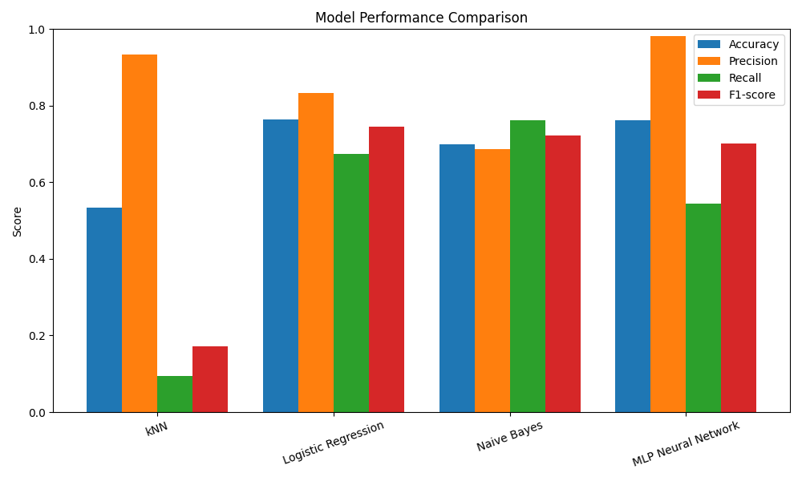
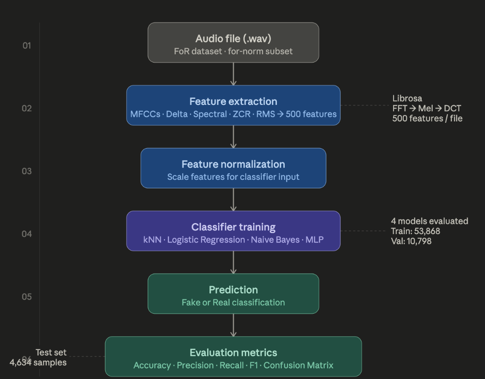

# Audio Deepfake Detection using Machine Learning

## Overview

This project develops a binary machine learning classifier capable of distinguishing authentic speech recordings from AI-generated speech.

The system extracts spectral audio features from speech recordings and evaluates several supervised learning algorithms to determine which model best identifies synthetic audio.

The project was developed as part of an introductory machine learning course while exploring applications of AI in audio forensics.

## Features

- Binary classification of authentic vs AI-generated speech
- Audio preprocessing pipeline
- Silence removal
- Feature normalization
- Spectral feature extraction
- Comparison of multiple machine learning models

## Models Evaluated

- Logistic Regression
- k-Nearest Neighbors
- Gaussian Naive Bayes
- Multi-Layer Perceptron

## Audio Features

The classifier extracts:

- MFCCs
- Delta MFCCs
- Delta-Delta MFCCs
- Spectral Centroid
- Spectral Bandwidth
- Spectral Rolloff
- Zero Crossing Rate
- RMS Energy

A total of 500 statistical audio features are generated for each recording.

## Dataset

### Fake-or-Real Audio Dataset

The dataset contains both authentic and AI-generated speech recordings for supervised binary classification.

Dataset source: [Fake-or-Real Audio Dataset on Kaggle](https://www.kaggle.com/datasets/mohammedabdeldayem/the-fake-or-real-dataset)


## Technologies

- Python
- NumPy
- pandas
- scikit-learn
- librosa
- matplotlib

## Evaluation Metrics

Models were evaluated using:

- Accuracy
- Precision
- Recall
- F1-score
- Confusion Matrix

## Results

Performance comparison on the test split:

| Model | Accuracy | Precision | Recall | F1 |
| --- | --- | --- | --- | --- |
| kNN | 0.533 | 0.933 | 0.094 | 0.171 |
| Logistic Regression | 0.765 | 0.834 | 0.674 | 0.745 |
| Naive Bayes | 0.700 | 0.686 | 0.762 | 0.722 |
| MLP Neural Network | 0.762 | 0.982 | 0.545 | 0.701 |



Confusion matrices are available in the `results/` directory for each model:

- `kNN_confusion_matrix.png`
- `Logistic_Regression_confusion_matrix.png`
- `Naive_Bayes_confusion_matrix.png`
- `MLP_Neural_Network_confusion_matrix.png`

## Pipeline



## Repository Structure

```text
audio-deepfake-detection/
├── data/
├── notebooks/
├── src/
├── results/
├── images/
├── requirements.txt
├── LICENSE
└── README.md
```

## Future Work

- CNNs for spectrogram classification
- Transformer-based audio models
- Larger speech datasets
- Cross-dataset generalization
- Real-time inference
